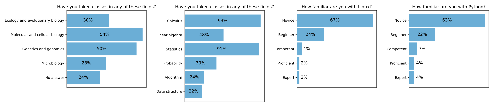
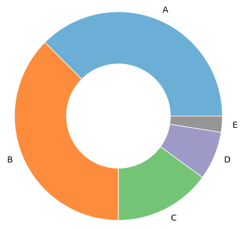

## BIO/MBB/MAT 355: Introduction to Computational Molecular Biology

- Instructor: [Dr. Qiyun Zhu](https://isearch.asu.edu/profile/3737104), Assistant Professor, School of Life Sciences
- Open in **Fall** semesters in the Tempe campus
- 3 credits, 2 x 75 min classes per week
- Open to all ASU graduate and undergraduate students
- An elective of the [Certificate for Computational Life Sciences](https://webapp4.asu.edu/programs/t5/majorinfo/ASU00/LACLSICERT/undergrad/true?init=false&nopassive=true)

_Due to the large volume of data generated by genome sequencing and cellular measurements of gene expression changes, computer science and mathematics have profoundly changed the science of modern biology. Computational methods are now critical to the development of both experimental and analytical tools in biological sciences. This course will provide students from all disciplines with an introduction to basic computational skills that are used to understand and analyze biological data. It combines both theories and applications, with a focus on the later._

**Download**: [2021 syllabus](assets/files/courses/355/2021_syllabus.pdf), [sample slides](assets/files/courses/355/2021_sample_slides.pdf), [sample code](assets/files/courses/355/2021_sample_code.ipynb)

**Computer lab**: All practices are performed using [Google Colab](https://colab.research.google.com/), a cloud-based platform that let you code in Bash, Python and more. You need to bring in a **laptop** with you to perform these practices.

**Programming**: You will learn how to program in Python as part of the coursework. Python skills from basic syntax to data science packages will be covered in the class.

**Group project**: You will work with your classmates in groups of 4-5 to complete a project of researching a bioinformatics-related question that interest you. You will present your work to the class and submit a write-up to the instructor in the end of the semester.

**Textbook**: No textbook is required.

**Prerequisites**: Because this is an upper level course, we prefer that students take MAT 119, 210, 243, 251, 265, or 270, or STP 220, 226, or 231 prior to this course. However, all mathematical, statistical and programming skills needed during the course will be covered in class.

Please find below a survey of the 2021 class in week 1 to know your classmates and your readiness for the class.

{: .align-center}

**Grading**: In 2021, the grading scheme is: quizzes: 25%, midterm and final exams: 20% + 20%, group project: 35%. It is subject to adjustment in future semesters.

Please find below the distribution of final letter grades of the 2021 class.

{: .align-center}

### Schedule

The following schedule is based on the 2021 class. It is subject to adjustment in the future.

- **Week 1: Introduction to molecular biology**
  - Biological systems from the perspective of informaticians, substance and information, central dogma.
  - Computing environment setup: Google Colab.

- **Week 2: Biological sequence data**
  - NCBI GenBank, FASTA format, structure of genes, molecular data: DNA, RNA and protein.
  - Introduction to Python, string operations, condition and iteration.

- **Week 3: Pairwise sequence alignment**
  - Sequence similarity, mutation, evolution, alignment scores.
  - Global and local alignment, dynamic programming, big O notion.
  - Python data structures: list, tuple and dictionary.

- **Week 4: Sequence homology search**
  - Sequence databases, BLAST, _k_-mer, indexing, heuristics.
  - Basic Linux commands, bioinformatics programs.

- **Week 5: Multiple sequence alignment**
  - Optimization problem, greedy algorithm, progressive alignment.

- **Week 6: Molecular phylogenetics - 1**
  - Evolution, traits, selection, cladistics.
  - Hierarchical clustering, distance-based methods,
  - Dendrogram, Newick format, Scikit-bio.

- **Week 7: Molecular phylogenetics - 2**
  - Maximum parsimony, maximum likelihood, Bayesian inference.
  - Probability theory, tree search.

- **Week 8: Comparative genomics**
  - Chromosome structure, genomic context, BED and GFF3 formats.
  - Set theory, Jaccard index, dot plot.
  - Python file I/O, line and column operations, Pandas, Matplotlib.

- **Week 9: Genome annotation**
  - Open reading frame, sequence motif, homology.
  - Hidden Markov model, Viterbi algorithm.

- **Week 10: Gene expression analysis**
  - High-throughput sequencing, transcriptome, NCBI SRA, FASTQ format.
  - Data quality control, read mapping, alignment-free methods.
  - Differential gene expression, statistical tests, FDR correction.
  - Linux text operations.

- **Week 11: Omics data analysis**
  - Feature table, transformation, standardization, visualization.
  - Dimensionality reduction: principal component analysis (PCA).
  - Cluster analysis: _k_-means, expectation-maximization.
  - Scikit-learn.

- **Week 12: Supervised learning**
  - Data preprocessing, encoding, imputation, resampling.
  - _k_-nearest neighbors, decision tree, random forest.
  - Model performance, cross-validation, hyperparameter tuning.

- **Week 13: Protein function and structure**
  - Protein function systems and databases.
  - Protein structure levels, motifs, domains.
  - Experimental methods, _ab initio_ modeling, homology modeling.
  - Deep neural network, GPGPU, Keras, AlphaFold2.

- **Week 14: Group project presentation**
