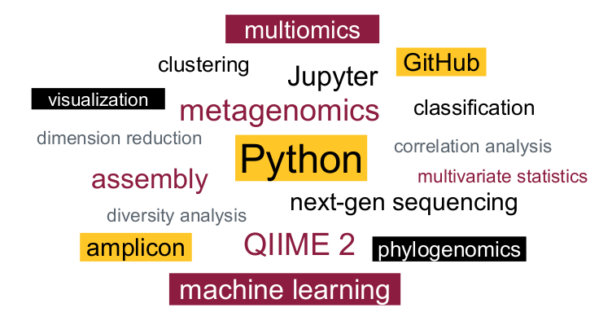

## BIO/MIC 494/598 Microbiome Data Science

- Instructor: [Dr. Qiyun Zhu](https://isearch.asu.edu/profile/3737104), Assistant Professor, School of Life Sciences
- Open in **Spring** semesters in the Tempe campus
- 3 credits, 2 x 75 min classes per week
- Open to all ASU graduate and undergraduate students

Microbiomes are communities of microbial organisms residing in certain natural or host-associated environments. Instead of isolating and cultivating individual microbes, the recently emerged field of microbiomics considers the community as a whole, and deciphers the composition and dynamics of the community based on rigorous bioinformatic analysis of large volume of data generated using next generation DNA sequencing and other high-throughput approaches.

The Microbiome Data Science course aims to make you a skillful and confident researcher in microbiome studies. It combines both theories and applications – with a focus on the later. You will be exposed to state-of-the-art and cutting-edge algorithms and programs in microbiomics. You will be trained in modern practices of data science, such as Linux and Python (the latter is optional for this class). You will be analyzing a real microbiome dataset, consisting of either 16S rRNA or shotgun metagenomic sequencing data, or both, with the optional addition of metabolomic or other “omic” data, as well as study-specific metadata. You will perform and record the study using Jupyter Notebook and post your progress on GitHub to achieve open-source, reproducible scientific research.

**Prerequisite**: None. Although skills in microbiology, statistics, Linux commands, Python programming will make the learning process easier, the course is designed in a way such that students with different levels of skills can complete the desired coursework.

**Format**: Monday classes are lectures; Wednesday classes are computer labs.

**Expectation**: You will form groups of 2-3, and complete a group project of analyzing a real microbiome dataset, selected by the group members, discussed and approved by the instructor. You will apply knowledge and skills acquired in the class to conduct the analysis and to interpret the results.

### Schedule

The following schedule is based on the 2021 class. It is subject to adjustment in the future.

Week | Lecture | Computer lab
---|---|---
1 | Introduction: microbial communities, hosts and environments | Linux system and  programs
2 | Open science and open-source coding | Jupyter and GitHub
3 | Study, samples and metadata |	QIIME 2 and Qiita
4 | DNA sequencing and 16S rRNA | Sequencing data, quality control, demultiplexing, denoising
5 | Shotgun metagenomics and sequence alignment | Reference database, alignment, _k_-mer
6 | Biodiversity and taxonomy | Taxonomic classification and profiling
7 | Evolution and phylogeny | Tree building, insertion and visualization
8 | Metagenome assembly and binning | _de novo_ assembly, and assembly quality assessment
9 | Function of microbiomes | Gene prediction, mapping, and classification
10 | Alpha diversity and simple statistics | Rarefaction, linear regression, correlation and statistical tests
11 | Beta diversity and multivariate statistics | Dimensionality reduction, clustering and statistical tests
12 | Differential abundance | Frequency and relative abundance, compositionality, multiple testing
13 | Supervised learning | Classification and regression, model fitting, evaluation and prediction
14 | Metabolomics and multiomics | Mass spectrometry data, multiomic correlation and ordination
15 | Open topic (suggested by the students) | (same as left)