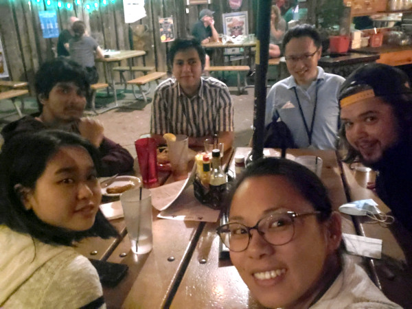

## Principal Investigator



## Postdoctoral Researchers



## Graduate Students



## Undergraduate students



## High School Students



## Alumni



## Join Us

<!-- {: .align-right} -->

<figure style="float: right; width: 600px; text-align: center; margin: 0.5em; padding: 0.5em;">
  
  <figcaption>Lab party (Dec 2021)</figcaption>
</figure>

We welcome undergraduate and graduate students with an interest in microbiomes and bioinformatics to join our highly motivated and collaborative team. You will conduct research on one or several projects that both advance the field and fit your specific interest. You will receive training in quantitative skills, big data analytics, software development, hypothesis testing, scientific communication, and other valuable aspects of scientific research.

Please contact **Dr. Qiyun Zhu** at Qiyun.Zhu[at]asu.edu to discuss about the opportunity.

&nbsp; 
&nbsp; 
&nbsp; 
&nbsp; 
&nbsp; 
&nbsp; 
&nbsp; 

