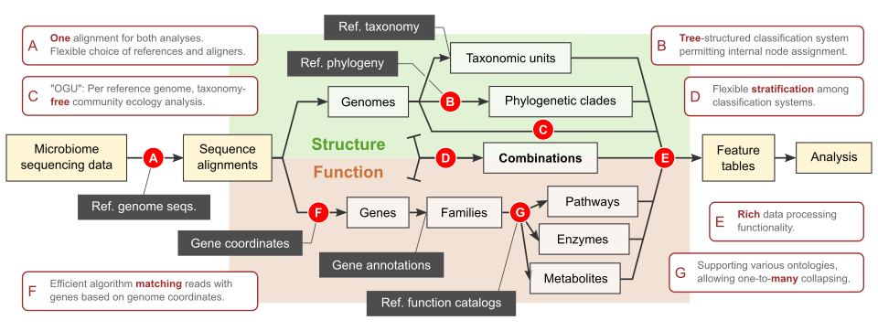
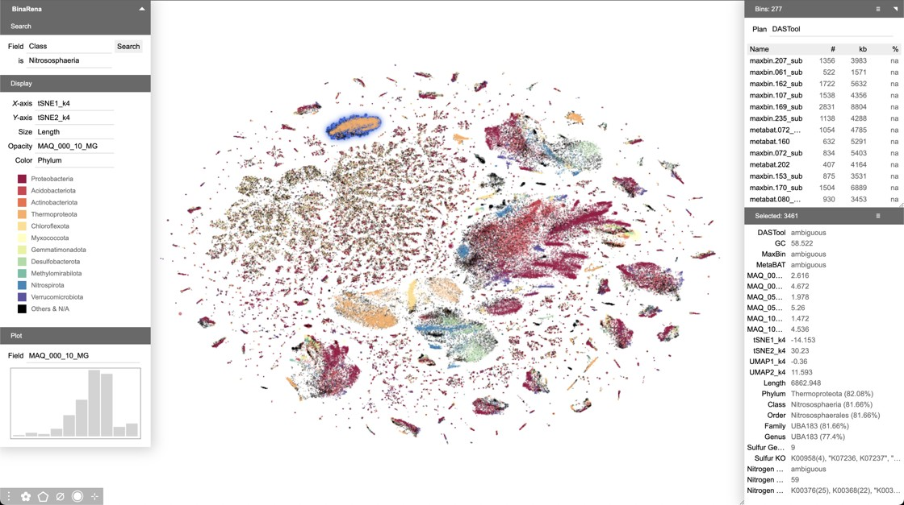

The rapid growth of microbiome data yields great opportunities to achieve higher accuracy, greater predictive power and novel insights into biology; at the same time, it poses great challenges in computation and statistics imposed by many dimensions of data and metadata. Advancing microbiome science demands fundamental innovations in both methods and applications, and can only be achieved by integrating wisdom from multiple disciplines. At the [Qiyun Lab](https://qiyunlab.github.io/), we are exploring a wide range of questions that span both the computational (e.g. community ecology to metagenome assembly) and the biological (e.g. the origin of life to the transmission of pathogenicity). We strive to push the frontier of microbiomics by combining the development of bioinformatics tools and the investigation of meta-omics datasets. We are dedicated to collaborative, reproducible and open-source science.



## Reference phylogeny of microbial genomes

Microbiome research relies on **references**--organized collections of sequences from previously studied microbial organisms. References play an essential role in the classification and functional annotation of microbiome data. The choice and design of reference can significantly impact analysis results. A useful reference for microbiome research comprises two essential components: 1. a comprehensive catalog of known sequences covering all or most microbial organisms that may be observed in a study, and 2. a knowledge graph that defines the relationships among these sequences, such as taxonomy, phylogeny, and gene ontology. We strive to enhance both these components in an integral manner.

<!-- {: .align-right}
*[Zhu et al. _Nat Commun_. 2019](https://www.nature.com/articles/s41467-019-13443-4)* -->

*WoL: a new view of the tree of life, adopted from Fig. 1 of [Zhu et al. _Nat Commun_. 2019](https://www.nature.com/articles/s41467-019-13443-4).*

<!-- <figure class="image">
  
  <figcaption>Hello there!</figcaption>
</figure> -->

<!--  -->

We initiated the "**Web of Life**" ([WoL](https://biocore.github.io/wol/)) project to generate a whole genome-based reference phylogeny of microbes. Our highly collaborative team developed or exploited cutting-edge computational approaches to harness the complexity of microbial genome and gene evolution. In phase I of the project ([Zhu et al. _Nat Commun_. 2019](https://www.nature.com/articles/s41467-019-13443-4)), we built a phylogeny of 10,575 genomes using 381 marker genes, making this the single largest dataset upon which _de novo_ phylogenetic trees have been built. Following the completion of WoL, we introduced the theory and protocol for building extremely large phylogenomic trees to the scientific community ([Zhu & Mirarab. _Methods Mol Biol_. 2022](https://link.springer.com/protocol/10.1007/978-1-0716-2691-7_7)).

In the recently completed phase II, our collaborative team constructed a much extended [**WoL2**](https://ftp.microbio.me/pub/wol2/), with 15,953 microbial genomes. Using the WoL2 phylogeny as a "backbone", and a novel phylogenetic placement method [uDance](https://github.com/balabanmetin/uDance) ([Balaban et al. _Nat Biotechnol_. 2023](https://www.nature.com/articles/s41587-023-01868-8)), we completed the **Greengenes 2** ([GG2](https://greengenes2.ucsd.edu/)) database ([McDonald et al. _Nat Biotechnol_. 2023](https://www.nature.com/articles/s41587-023-01845-1)), encompassing 21 million 16S rRNA sequences. This work not only delivered comprehensive references to the microbiomics community, but also achieved harmonization of 16S rRNA and shotgun data for the first time, yielding highly consistent analysis results.

The WoL reference phylogeny not only extended knowledge of microbial evolution (see [below](#evolution-of-microbes-traits-and-functions)), but also supported us, collaborators and the research community to make novel discoveries in a broad range of microbiome studies (such as [Fu et al. _Cell Rep_. 2023](https://www.cell.com/cell-reports/fulltext/S2211-1247(23)01008-2), [Mills et al. _Nat Microbiol_. 2022](https://www.nature.com/articles/s41564-021-01050-3), and [Karst et al. _Nat Methods_. 2021](https://www.nature.com/articles/s41592-020-01041-y)).

Looking beyond, we aim at developing better references, and better approaches for building and utilizing references for the microbiome research community. Our efforts include optimizing genome sampling and marker gene selection, investigating the association between reference composition and analysis results, and exploring alternative graph types and construction methods.

## Phylogeny-guided microbiome analysis

Microbiome research has long benefitted from [phylogeny](https://en.wikipedia.org/wiki/Phylogenetic_tree) which makes sense of high-dimensional data by using a hierarchical representation of their relationships. Algorithms like UniFrac and Faith's PD along with databases like Greengenes and Silva have been widely adopted in 16S rRNA data analysis to describe microbial communnity structure based on the evolutionary relationships. However, in the rapid-growing field of shotgun metagenomics, the utilization of phylogeny is still rare and primitive. Most studies are limited to the analysis of lower-dimensional genus- or species-level taxonomic units by using non-hierarchical methods, or rely on the taxonomy tree, which is inherently less accurate and more error-prone than explicit phylogeny.

In parallel to building reference phylogenies, we develop bioinformatic approaches to utilize these phylogenies in the analysis of shotgun metagenomic data. Specifically, we are in active development of [**Woltka**](https://github.com/qiyunzhu/woltka) ([Zhu et al. _mSystems_. 2022](https://journals.asm.org/doi/full/10.1128/msystems.00167-22)), a bioinformatics package integrating multiple novel ideas, algorithms and protocols which enhance the analytics of shotgun metagenomic datasets by using the reference phylogeny. It operates on individual genomes -- rather than taxonomic units -- as the basic elements. Woltka uses a tree-based, rank-free classification system to maximize accuracy and flexibility. It combines taxonomic & functional analysis through one alignment against the reference genome database to ensure consistency and accuracy.

*Scope and highlights of the [Woltka](https://github.com/qiyunzhu/woltka) package.*

The Woltka package enabled us to explore fundamental questions in microbiome data science, such as the impact of database composition, relationship graph and sampling depth on analysis results ([Zhu et al. _mSystems_. 2022](https://journals.asm.org/doi/full/10.1128/msystems.00167-22)). It has facilitated multiple studies of microbiomes in various diseases and natural environments (such as [Morton et al. _Nat Neurosci_. 2023](https://www.nature.com/articles/s41593-023-01361-0), [Narunsky-Haziza et al. _Cell_. 2022](https://www.cell.com/cell/fulltext/S0092-8674(22)01127-8), and [Shaffer et al. _Nat Microbiol_. 2022](https://www.nature.com/articles/s41564-022-01266-x)).

In the direction of phylogeny-guided microbiome analysis, we are actively investigating new methodologies. These include combined analyses of microbiome composition and function, phylogeny-driven feature engineering, phylogeny-based supervised learning, and other innovative and crucial approaches.

## Evolution of microbes, traits and functions

The natural history of living organisms is among the most fundamental and long-standing questions in science. Culture-independent methods, especially metagenomics, have enabled many exciting discoveries of novel microbial groups in recent years. This has led to repeated re-writings of the tree of life, and yielding markers and products of medical, environmental and technological importance.

The study of whole genome evolution, a.k.a. phylogenomics, often yields novel insights compared with conventional methods which are limited to one or a few genes. For example, our [WoL](https://biocore.github.io/wol/) tree revealed that the two domains Bacteria and Archaea are remarkably closer in evolution than previously estimated using a handful of “core” genes ([Zhu et al. _Nat Commun_, 2019](https://www.nature.com/articles/s41467-019-13443-4)). Further investigation showed that the Candidate Phyla Radiation (CPR), a highly diversified clade of mainly uncultivated microorganisms, are distinct from the remaining bacteria in phylogeny and in gene profiles. This inspires us to extend research in this and other mysterious clades of life.

The evolutionary "tree" of microbes is often confounded by the discrepancies among individual genes trees due to the prevalence of horizontal gene transfer events ([HGTs](https://en.wikipedia.org/wiki/Horizontal_gene_transfer)). HGTs play vital roles in the adaptation of pathogens to host environments and the dispersal of virulence and antibiotic resistance. We develop computational methods for HGT identification, including [HGTector](https://github.com/DittmarLab/HGTector), an algorithm that has been shown effective in multiple studies, as well as more comprehensive methods incorporating similarity, composition, context, phylogeny and other characteristics indicative of HGTs. Our goal is to identify the true “web of life”: a network structure incorporating both vertical and horizontal evolutions.

## Human-guided exploration and analysis of metagenomes

Metagenomic sequencing of environmental samples has emerged as a primary avenue for discovering new biodiversity. In a typical workflow, data from 2nd or 3rd-generation sequencing techniques are assembled into contigs, which are then "[binned](https://en.wikipedia.org/wiki/Binning_(metagenomics))" based on their presumed organismal origins. These groupings, known as metagenome-assembled genomes ([MAGs](https://www.nature.com/articles/nbt.3893)), are then analyzed to determine their evolutionary status, genetic structures, and functional capabilities. Despite advancements in automated algorithms, this process remains challenging. Researchers frequently find themselves manually reviewing and adjusting the results to achieve accurate binning.

In our study on travelers' diarrhea (TD) metagenomes [Zhu et al. _Microbiome_. 2018](https://microbiomejournal.biomedcentral.com/articles/10.1186/s40168-018-0579-0), we introduced principles and workflows for a combined manual and algorithmic approach to metagenomic binning. A key feature of our methodology is the effective visualization of assembly contigs, enhancing human understanding and interpretation. This approach allowed us to distinguish and extract pathogenic genomes from a noisy background of closely related organisms.

Motivated by this work, we developed [**BinaRena**](https://github.com/qiyunlab/binarena/) ([Pavia et al. _Microbiome_. 2023](https://microbiomejournal.biomedcentral.com/articles/10.1186/s40168-018-0579-0)), a software package exclusively designed for human-centric exploration and manipulation of metagenomic contigs. BinaRena unleashes human strengths in pattern recognition and reasoning, and effectively complements computational algorithms. It facilitates hypothesis generation, strain isolation, and bin refinement.

*Main interface of [BinaRena](https://github.com/qiyunlab/binarena/), showing a peatland metagenome.*

We continue to investigate ways to seamlessly merge algorithmic processes with human insights for a semi-supervised analysis of metagenomic data, aiming for a balance of accuracy, interpretability, and reproducibility.

## Interplay of microbiomes with hosts and environments

Microbial communities interact with their environments -- either host-associated (human gut, oral, skin, etc.) or free-living (soil, carbonate, deep sea, etc.). Such interactions are hiding under the complexity of biological big data. Analysis of biological big data is increasingly needed yet extremely challenging for scientists. Capturing correlations among multiple omics datasets with hundreds to thousands of dimensions, and dozens to hundreds of metadata fields coded in diverse formats is a monumental task that only recently scientists have begun to understand how to approach.

<!--  -->

We are experts in data science for meta-omics. We collaborate with scientists from multiple disciplines to answer specific questions about how microbiomes interact with hosts and environments. Using the latest and most advanced computational approaches -- multiple of which are developed by us or with our contributions -- we cluster samples based on community diversity, characterize community changes along time series or feature gradients, explore correlations between microbes or  chemicals, identify differentially abundant species across test groups, and build machine learning models to identify biomarkers that best predict the status of subjects.

For example, in a study of the microbiome and metabolome of the built environment and body sites across an urbanization gradient in the Amazon rainforest, we found correlations between bacterial and fungal diversity and urbanization, especially the use of chemical products along with altered lifestyle ([_Nat Microbiol_, 2020](https://www.nature.com/articles/s41564-019-0593-4)). In a systematic and deliberate survey of public datasets, we characterized microbial communities present in various cancer tissues and built highly predictive machine models which have diagnostic potentials ([_Nature_, 2020](https://www.nature.com/articles/s41586-020-2095-1)). Through a combined investigation of six omics data types, we found microbial determinants of ulcerative colitis severity which guided subsequent successful experimental validation (in submission).

We are committed to building a competitive and comprehensive microbiome data science platform to bring together researchers from various fields to explore the many exciting opporunities about microbiomes and beyond.
